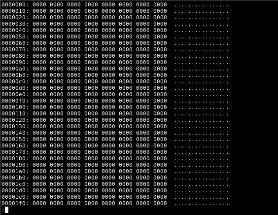

## Основы Професиональной Деятельности

На курсе студенты знакомятся с так называемой БЭВМ-2 - Базовой Электронно-Вычислительной Машиной. В деталях разбираются принципы работы процессора (АЛУ, Коммутатор, Микрокод), памяти, регистров, прерывания, стек, подпрограммы, перывания, синтез комманд и так далее. 

Многие преподователи склонны пугать студентов данным курсом (типа он сложный и всё очень плохо), так как чтобы освоить его, действительно, нужно приложить усилия, однако понимание основных принципов работы БЭВМ даст вам плацдарм для изучения её полностью.

Курс был доработан в 2019-20 годах, соответственно БЭВМ модернизировали и появилась 2 версия.

## Лабораторные работы

| номер | сложность | описание                                                                                                                                                           |          теория           |
| ----- | :-------: | ------------------------------------------------------------------------------------------------------------------------------------------------------------------ | :-----------------------: |
| 1     |    🟨     | Основы команд на linux. Не знаю зачем это сюда впихнули, разве что поработать на гелиосе и сразу не пугать незадачливого студика (т.е. меня) всякими ассемблерами. |                           |
| 2     |    🟥     | Большая. Новая. Сложная. Принималась у меня довольно долго. Если сделать её до допов по опд, то есть шанс, что за семестр вы получите зачет автоматом.             |                           |
| 3     |    🟨     | Массивы, виды адрессации, команды ветвления и циклы. В целом, поменьше 2-ой.                                                                                       | [📑](2sem/lab3/README.md) |
| 4     |    🟨     | Стек, SP. Похожа на третюю, нужно знать принципы работы стека, команды. Норм.                                                                                      |                           |
| 5     |    🟥     | Асинхронный ввод/вывод устройств с помощью spin loopa. Много писать на ассемблере, большое задание, не менее большой доп.                                          |                           |
| 6     |    🟨     | Прерывания, всё, что с этим связанно. Вектор прерывания, MR, по какому принципу в БЭВМ происходят прерывания.                                                      |                           |
| 7     |           |                                                                                                                                                                    |                           |

## Теория

| название                          | ссылка                    | описание                                        |
| --------------------------------- | ------------------------- | ----------------------------------------------- |
| Немного о БЭВМ                    | [📑](ABOUT_BEC.md)        | Краткая история, что это, зачем это и так далее |
| Важные таблицы БЭВМ-2             | [📑](IMPORTANT_TABLES.md) | -                                               |
| Теория для подготовки к экзаменам | [📑](EXAM.md)             |                                                 |

### Микролекции

| название                           | ссылка                                     | описание |
| ---------------------------------- | ------------------------------------------ | -------- |
| 1. Не запутаться в видах адресации | [📑](microlectures/TYPES_OF_ADDRESSING.md) | -        |
| 2. Функции и соглашения вызовов    |                                            | -        |
| ...                                |                                            |          |
|                                    |                                            |          |

## Рубежка

Основная статья [2 сем рубежка](rubezh/README.md)

## Экзамен

Основная статья про [экзамен](EXAM.md)
## Полезные источники

1. Инфа по курсу [здесь](https://se.ifmo.ru/courses/csbasics)
2. Полезная книжка, читать всем - [тык](https://books.ifmo.ru/file/pdf/761.pdf)
3. Менее полезная, но не менее важная методичка - [тут](Books/Методические указания к выполнению лабораторных работ и рубежного контроля БЭВМ 2019 bcomp-ng)
4. Презентация 2 семестра по ОПД - тук