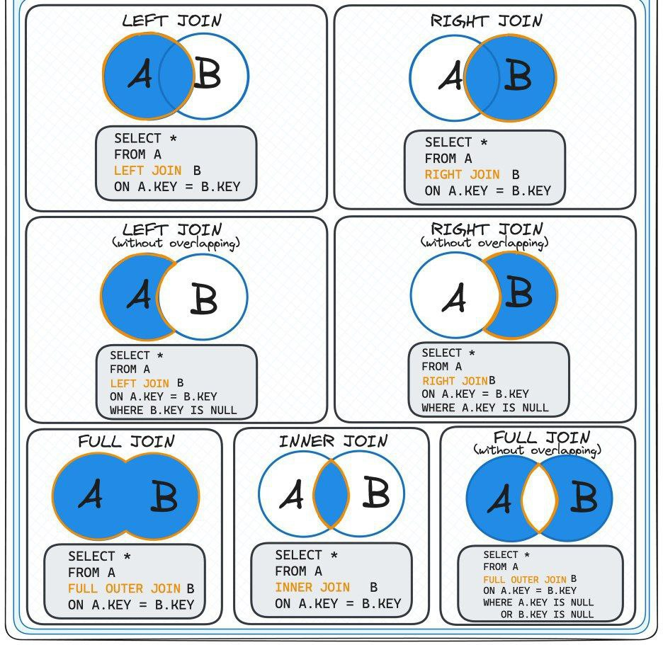

## Лабораторная работа #2

### Задание

По варианту, выданному преподавателем, составить и выполнить запросы к [базе данных "Учебный процесс"](https://se.ifmo.ru/documents/10180/733702/%D0%91%D0%94+%D0%A3%D1%87%D0%B5%D0%B1%D0%BD%D1%8B%D0%B9+%D0%9F%D1%80%D0%BE%D1%86%D0%B5%D1%81%D1%81.pdf/2eae3fcd-ea34-4496-924b-6ee4e889a9e5).

Команда для подключения к базе данных ucheb:

_psql -h pg -d ucheb_

#### Отчёт по лабораторной работе должен содержать:

1. Текст задания.
2. Реализацию запросов на SQL.
3. Выводы по работе.

#### Темы для подготовки к защите лабораторной работы:

1. SQL
2. Соединение таблиц
3. Подзапросы
4. Представления
5. Последовательности

#### [Решение тут](SOLUTION.md)

## Теория

### SQL

**Структурированный язык запросов** (SQL) используется для описания структуры базы данных, манипулирования данными в базе и предъявления запросов. Он также используется для определения и изменения структуры базы, т. е. для реа­лизации модели данных.

SQL состоит из трех частей:
- язык определения данных (DDL);
- язык манипулирования данными (DML);
- язык управления данными (DCL).

Язык DDL нужен для создания и управления структурой данных, язык DML –
для управления самими данными, а язык DCL – для управления доступом
к данным. Обычно структура данных определяется только один раз и изменяется сравнительно редко. Но вставка, изменение и выборка данных производятся постоянно. Поэтому DML используется чаще, чем DDL.

В отличие от многих других языков, SQL – не императивный язык программирования. Точнее, на нем невозможно подробно описать алгоритм обработки данных. Поэтому может сложиться впечатление, будто мы не способны управлять данными. На императивном языке программист описывает работу с данными на очень детальном уровне: откуда взять данные и как это сделать, как обойти массив записей, когда и как обработать их. Если необходимо обработать данные из нескольких источников, то программист должен реализовать связи между ними на уровне приложения, а не в самой базе.

Но SQL – декларативный язык. Иными словами, чтобы получить тот же результат на других языках, нужно написать целую историю. А на SQL разработчик пишет только предложение, выражающее суть, а детали оставляет базе данных. В SQL-команде определяем формат, в котором мы хотим получить данные, указываем, в каких таблицах данные хранятся, и формулируем правила их обработки. Все необходимые операции, их точный порядок и алгоритмы обработки данных определяет база, а разработчику до этого не должно быть дела.

Еще одна отличительная особенность SQL – наличие стандарта языка. Это
означает, что все современные реляционные базы данных поддерживают SQL.
Конечно, в каждой базе есть собственный диалект SQL с дополнительными
возможностями, но ядро языка везде одно и то же. 

Кстати, в самом начале пути база postgres не поддерживала SQL. Он был добавлен лишь в 1994 году, и, чтобы отметить этот факт, база была переименована в PostgreSQL.

#### Пример запроса

```sql
SELECT поля FROM таблицы WHERE условия...;
```

Вместо WHERE может быть:

- **WHERE** - для определения, какие строки должны быть выбраны или включены в **GROUP BY**
- **GROUP BY** - для объединения строк с общими значениями в элементы меньшего набора строк
- **HAVING** - для определения, какие строки после **GROUP BY** должны быть выбраны
- **ORDER BY** -  сортировка результирующего набора данных

#### Логические операторы

- AND
- NOT
- OR
- true, false, NULL

AND и OR коммутативны

#### Предикаты сравнения

| Оператор                     | Описание                                         |
| ---------------------------- | ------------------------------------------------ |
| `a` BETWEEN `x` AND `y`      | `a` между `x` и `y` (включительно)               |
| `a` NOT BETWEEN `x` AND `y`  | `a` не между `x` и `y`                           |
| `a` IS DISTINCT FROM `b`     | Как `<>`, но `NULL` считается отличным от `NULL` |
| `a` IS NOT DISTINCT FROM `b` | Как `=`, но `NULL` считается равным `NULL`       |
| `выражение` IS NULL          | Проверка на `NULL`                               |
| `выражение` IS NOT NULL      | Проверка на не-`NULL`                            |

#### Поиск по шаблону: LIKE (поиск в строке)

```sql
строка LIKE шаблон
строка NOT LIKE шаблон
```

Выражение LIKE возврещает TRUE, если строка соответствует заданному шаблону

#### **SIMILAR TO (регулярные выражения SQL-стандарта)**

```sql
строка SIMILAR TO шаблон
строка NOT SIMILAR TO шаблон
```

Выражение SIMILAR TO возвращает true, если строка соответствует заданному шаблону. Поддерживает больше видов регулярных выражений, чем LIKE

##### **Когда что использовать?**

| Оператор     | Когда применять?                        |
| ------------ | --------------------------------------- |
| `LIKE`       | Простые шаблоны (`%test%`, `user_123`). |
| `SIMILAR TO` | Сложные шаблоны (микс `LIKE` и regex).  |
| `~` / `~*`   | Полноценные регулярные выражения.       |

**Совет:** Для сложных поисков (например, валидации email) используйте `~`, для простых — `LIKE`.

### Соединение таблиц



#### INNER JOIN (Внутреннее соединение)
Возвращает строки, где есть соответствие в обеих таблицах.

```sql
SELECT a.*, b.*
FROM table_a a
INNER JOIN table_b b ON a.id = b.a_id;
```

#### LEFT JOIN (LEFT OUTER JOIN)

Возвращает все строки из левой таблицы и соответствующие из правой (или NULL, если соответствий нет).

```sql
SELECT a.*, b.*
FROM table_a a
LEFT JOIN table_b b ON a.id = b.a_id;
```

#### RIGHT JOIN (RIGHT OUTER JOIN)

Возвращает все строки из правой таблицы и соответствующие из левой (или NULL, если соответствий нет).

```sql
SELECT a.*, b.*
FROM table_a a
RIGHT JOIN table_b b ON a.id = b.a_id;
```

#### FULL JOIN (FULL OUTER JOIN)

Возвращает все строки из обеих таблиц, с NULL там, где нет соответствий.

```sql
SELECT a.*, b.*
FROM table_a a
FULL JOIN table_b b ON a.id = b.a_id;
```

#### CROSS JOIN

Декартово произведение - каждая строка из первой таблицы соединяется с каждой строкой из второй.

```sql
SELECT a.*, b.*
FROM table_a a
CROSS JOIN table_b b;
```

#### NATURAL JOIN

Соединяет таблицы по столбцам с одинаковыми именами (не рекомендуется).

```sql
SELECT *
FROM table_a
NATURAL JOIN table_b;
```

#### SELF JOIN

Соединение таблицы с самой собой. 

Это метод сравнения записей внутри одной и той же таблицы, который создаёт эффект «двойного зеркала». Это можно сравнить с добавлением своего же портрета в групповое изображение.

```sql
SELECT
    e1.name AS 'Сотрудник',
    e2.name AS 'Менеджер'
FROM
    employees e1
JOIN
    employees e2 ON e1.manager_id = e2.id;
```

#### JOIN нескольких таблиц

```sql
SELECT a.*, b.*, c.*
FROM table_a a
JOIN table_b b ON a.id = b.a_id
JOIN table_c c ON b.id = c.b_id;
```

### Подзапросы


### Представления


### Последовательности


