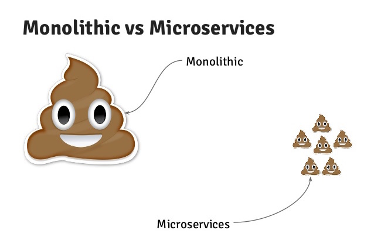

# Основы Программной Инженерии

 

## Основная информация

Лектор: Клименков Сергей Викторович
Практик: Егошин Алексей Васильевич

## Полезная литература

см. [заметки первой лекции](docs/Конспект%2004.02.2026.md), ну или ксв так и так расскажет

## Лабораторные работы

| номер | сложность | описание |
| ----- | --------- | -------- |
| 1     |           |          |
| 2     |           |          |
| 3     |           |          |
| 4     |           |          |

## Полезные источники

1. Blank